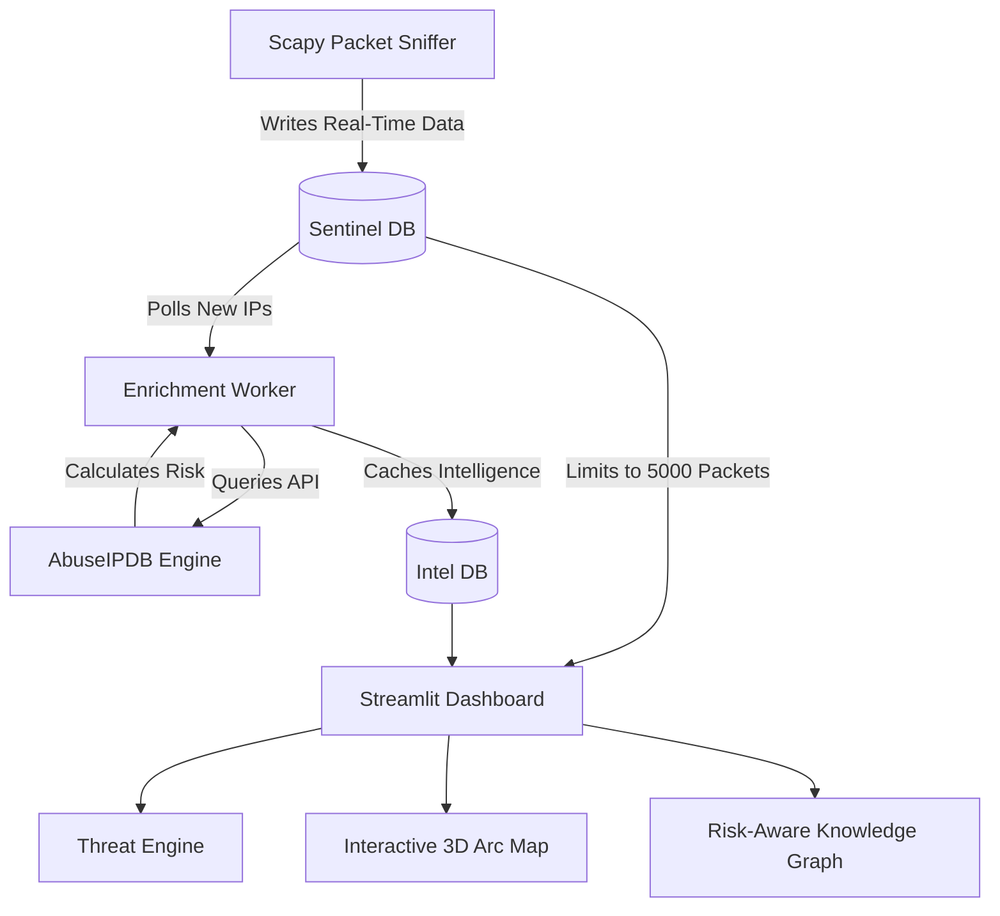

<div align="center">
  <h1>📡 Sentinel Network Intelligence Platform</h1>
  <p><strong>An advanced, real-time network traffic analyzer with built-in threat detection, host reputation, and interactive 3D GeoIP mapping.</strong></p>

  <p>
    
    
    
    
  </p>
</div>

---

## 🚀 Overview

Most packet sniffers just capture data. **Sentinel** acts as an active Network Intelligence tool. 

Built with an explainable real-time **Threat Engine** and a pure **SQLite backend**, Sentinel analyzes your local network traffic to detect port scans, unencrypted HTTP traffic, large outbound transfers, and DNS tunneling attempts. It automatically validates unknown hosts against ISP data and visualizes your endpoints on a live, interactive 3D World Map and an interactive Knowledge Graph.

## 🧠 Architecture

Sentinel utilizes a highly robust decoupled architecture. By separating packet sniffing, threat enrichment, and UI rendering into distinct processes with SQLite Write-Ahead Logging (WAL), Sentinel completely avoids the Out-Of-Memory (OOM) crashes that plague typical Scapy sniffers.



---

## ✨ Premium Features

- **Live Packet Capture**: Captures continuous background network traffic without exploding memory thanks to periodic SQLite flushing.
- **Explainable Threat Engine**: Automatically flags suspicious activity (Port Scans, Cleartext HTTP, Large Outbound Data) and provides human-readable evidence for the alert.
- **Risk Scoring Algorithm**: Generates a composite Risk Score (0-100) by combining AbuseIPDB intel, adversarial geography context, VPN/Tor infrastructure usage, and local behavioral anomalies.
- **Automated Threat Intelligence**: A background daemon automatically queries new external IP addresses against AbuseIPDB and caches results in `intel.db` to prevent API rate-limiting.
- **3D GeoIP Arc Mapping**: Visualizes global traffic on a PyDeck map with 3D glowing traffic arcs flying from your local machine to the destination.
- **Risk-Aware Knowledge Graph**: Generates a dynamic PyVis network graph natively from SQLite, coloring nodes (Red/Yellow/Green) based on their assigned Threat Classification.

---

## 🛠️ Installation

```bash
# 1. Clone the repository
git clone https://github.com/Pranavkalkur/Sentinel-Network-Intelligence-Platform.git
cd Sentinel-Network-Intelligence-Platform

# 2. Create and activate a virtual environment
python3 -m venv venv
source venv/bin/activate

# 3. Install dependencies
pip install -r requirements.txt

# 4. Optional: Configure API Keys
# Create a .env file to enable live AbuseIPDB queries (otherwise, it runs in simulation mode)
echo "ABUSEIPDB_API_KEY=your_key_here" > .env
```

---

## 💻 Usage Instructions

Sentinel utilizes a 3-process architecture for maximum stability. You must run these in separate terminal windows.

### Step 1: Start the Packet Sniffer (Terminal 1)
You must run the background packet sniffer with `sudo` privileges so Scapy can bind to the network interface.
```bash
source venv/bin/activate
sudo python3 packet_sniffer.py
```

### Step 2: Start the Threat Enrichment Daemon (Terminal 2)
Launch the background worker that polls SQLite for new IPs and securely caches AbuseIPDB threat intelligence.
```bash
source venv/bin/activate
python3 enrichment_worker.py
```

### Step 3: Start the Threat Dashboard (Terminal 3)
Launch the live Streamlit UI to visualize the SQLite streams.
```bash
source venv/bin/activate
streamlit run dashboard.py
```
*The dashboard will instantly open in your browser (`http://localhost:8502`).*

---

## 🛡️ The Threat Engine Rules

Sentinel currently monitors for 5 distinct behavioral anomalies:

1. **Port Scans:** Flags external IPs that connect to more than 10 unique destination ports within a rolling 3.0-second window.
2. **Cleartext Transmissions:** Flags any packets operating on Port 80 (HTTP), warning of potential credential exposure.
3. **Large Outbound Exfiltration:** Identifies your local machine IP and tracks isolated outbound transfers exceeding 500MB to a single destination.
4. **Traffic Spikes:** Calculates a rolling baseline of packets-per-second (pps) and flags bursts exceeding 3 standard deviations above the mean.
5. **DNS Tunneling:** Inspects Port 53 queries for abnormally long hostname strings (>50 chars), a common technique for padded malware exfiltration.
