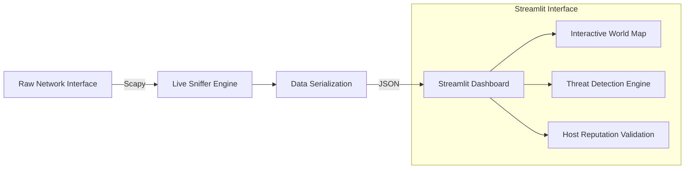

<h1 align="center">
  📡 Sentinel: AI-Powered Network Intelligence
</h1>

<p align="center">
  <strong>A real-time network traffic analyzer with built-in threat detection, host reputation, and interactive 3D GeoIP mapping.</strong>
</p>

<p align="center">
  
  
  
</p>

---

## 🚀 Overview

Most packet sniffers just capture data. **Sentinel** acts as an active Intelligence tool. 

Built with an explainable real-time Threat Engine, Sentinel analyzes your local network traffic to detect port scans, unencrypted HTTP traffic, large outbound transfers, and DNS tunneling attempts. It automatically validates unknown hosts against ISP data and visualizes your endpoints on a live, interactive 3D World Map.

### ✨ Key Features
- **Live Continuous Capture:** Sniff network traffic indefinitely and asynchronously update the dashboard without dropping packets.
- **Explainable Threat Engine:** Alerts are generated with strict, statistically sound confidence scores and evidence strings (e.g., detecting standard deviations in traffic spikes).
- **Interactive GeoIP Map:** All endpoints are visually mapped using PyDeck on a beautiful dark-mode interface.
- **ISP-Driven Host Intelligence:** Identifies untrusted hosts precisely by extracting registered ISP boundaries (e.g., Google LLC, Cloudflare).
- **Network Knowledge Graph:** Generates interactive node graphs to visualize the relationships between local apps and external domains.

---

## 🛠️ Installation

```bash
# 1. Clone the repository
git clone https://github.com/yourusername/Sentinel.git
cd Sentinel

# 2. Create a virtual environment
python3 -m venv venv
source venv/bin/activate

# 3. Install dependencies
pip install -r requirements.txt
```

---

## 💻 Usage

Sentinel runs in two parts: the background packet sniffer, and the Streamlit dashboard.

### 1. Start the Live Capture
To capture packets, the sniffer must be run with root privileges.
```bash
sudo python3 packet_sniffer.py
```
*Leave this terminal running in the background. It will automatically flush state to JSON files every 25 packets.*

### 2. Launch the Dashboard
In a **new terminal window**, start the Streamlit UI:
```bash
streamlit run dashboard.py
```

---

## 🧠 Architecture



---

## 🛡️ Example Alerts
- **Port Scan Detected (95% Confidence):** Observed 24 unique destination ports targeted within a 3.0s window.
- **Cleartext HTTP (100% Confidence):** Packet captured transmitting on unencrypted port 80. Credentials and payloads are exposed.
- **Traffic Spike (85% Confidence):** Traffic volume reached 150 pps, violating the established baseline of 2.1 pps (+3 standard deviations).

---
<p align="center">
  <i>Built for modern security analysis.</i>
</p>
