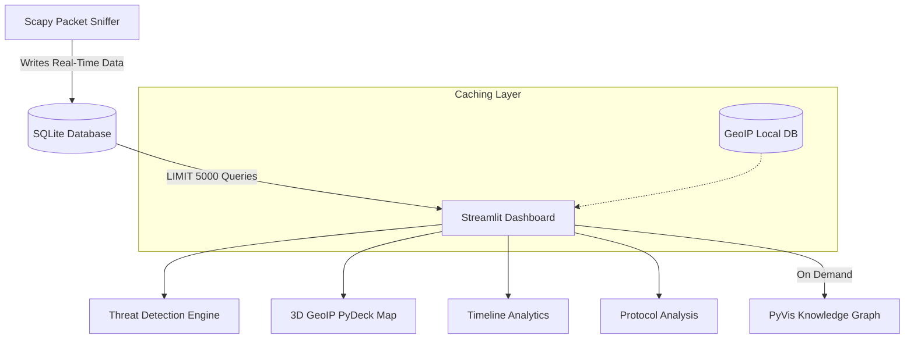

<div align="center">
  <h1>📡 Sentinel Network Intelligence Platform</h1>
  <p><strong>An advanced, real-time network traffic analyzer with built-in threat detection, host reputation, and interactive 3D GeoIP mapping.</strong></p>

  <p>
    
    
    
    
  </p>
</div>

---

## 🚀 Overview

Most packet sniffers just capture data. **Sentinel** acts as an active Network Intelligence tool. 

Built with an explainable real-time **Threat Engine** and a pure **SQLite backend**, Sentinel analyzes your local network traffic to detect port scans, unencrypted HTTP traffic, large outbound transfers, and DNS tunneling attempts. It automatically validates unknown hosts against ISP data and visualizes your endpoints on a live, interactive 3D World Map and an interactive Knowledge Graph.

## 🧠 Architecture

Sentinel was completely redesigned to handle massive network loads without Out-Of-Memory (OOM) crashes by utilizing a split-process SQLite Write-Ahead Logging (WAL) architecture.



---

## ✨ Premium Features

- **Live Packet Capture**: Captures continuous background network traffic without exploding memory thanks to periodic SQLite flushing.
- **Explainable Threat Engine**: Automatically flags suspicious activity (Port Scans, Cleartext HTTP, Large Outbound Data) and provides human-readable evidence for the alert.
- **Host Reputation Intelligence**: Validates destination IP addresses against known, trusted ISP and cloud infrastructure blocks.
- **3D GeoIP Arc Mapping**: Pings endpoints to generate a global PyDeck map with 3D glowing traffic arcs flying from your local machine to the destination.
- **Interactive Knowledge Graph**: Generates a dynamic PyVis network graph natively from the SQLite `connections` table to visualize relationships between your computer, protocols, and external corporations.

---

## 🛠️ Installation

```bash
# 1. Clone the repository
git clone https://github.com/Pranavkalkur/Sentinel-Network-Intelligence-Platform.git
cd Sentinel-Network-Intelligence-Platform

# 2. Create and activate a virtual environment
python3 -m venv venv
source venv/bin/activate

# 3. Install dependencies
pip install -r requirements.txt
```

---

## 💻 Usage Instructions

Because Sentinel uses a split architecture for stability, you must run the backend and frontend in separate terminals.

### Step 1: Start the Engine (Terminal 1)
You must run the background packet sniffer with `sudo` privileges to allow it to listen to your network interface.
```bash
source venv/bin/activate
sudo python3 packet_sniffer.py
```
*Leave this running in the background. It will automatically initialize the database and populate it using WAL mode.*

### Step 2: Start the UI (Terminal 2)
Open a new terminal tab to launch the live Streamlit dashboard.
```bash
source venv/bin/activate
streamlit run dashboard.py
```
*The dashboard will instantly open in your browser (`http://localhost:8502`) and visualize the incoming SQLite stream.*

---

## 🛡️ The Threat Engine Rules

Sentinel currently monitors for 5 distinct behavioral anomalies:

1. **Port Scans:** Flags external IPs that connect to more than 10 unique destination ports within a rolling 3.0-second window.
2. **Cleartext Transmissions:** Flags any packets operating on Port 80 (HTTP), warning of potential credential exposure.
3. **Large Outbound Exfiltration:** Identifies your local machine IP and tracks isolated outbound transfers exceeding 500MB to a single destination.
4. **Traffic Spikes:** Calculates a rolling baseline of packets-per-second (pps) and flags bursts exceeding 3 standard deviations above the mean.
5. **DNS Tunneling:** Inspects Port 53 queries for abnormally long hostname strings (>50 chars), a common technique for padded malware exfiltration.
